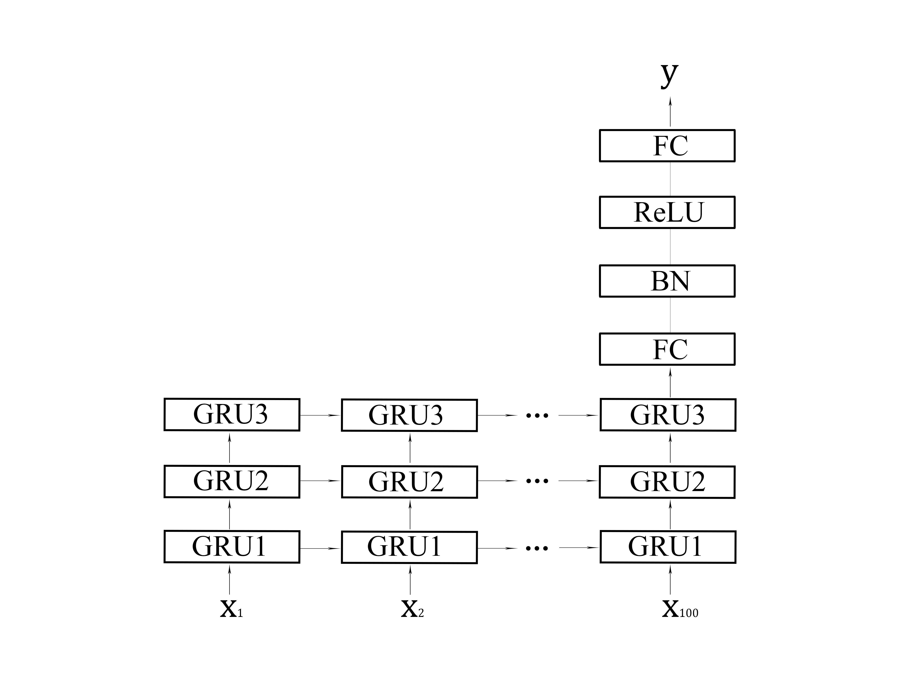

# Age Estimation From fMRI Data Using Recurrent Neural Network

Use a deep learning network Gated Recurrent Unit (GRU) to analyze functional magnetic resonance imaging (fMRI) data from the human brain at rest to estimate the age of the subject.

## Data Sources

Use 795 publicly available fMRI images at rest.
There are 26 projects.
Among them, 25 projects are from the [1000 Functional Connectomes Project](http://fcon_1000.projects.nitrc.org/fcpClassic/FcpTable.html).
The remaining project has 369 samples from the [Southwest University Adult Lifespan Dataset](http://fcon_1000.projects.nitrc.org/indi/retro/sald.html).

## Tool

Use the FMRIB software library (FSL) to preprocess fMRI data.
And write GRU model using PyTorch.

### FSL

FSL is widely used analytical tool library for brain imaging data such as fMRI, MRI and DTI.
It can be used on Mac and PCs (both Linux, and Windows via a Virtual Machine).
Detailed installation tutorial reference [FSL website](https://fsl.fmrib.ox.ac.uk/fsl/fslwiki/).

## Data Preprocessing

Set the processing parameters according to each project.
First, use FEAT of FSL to process a random sample of each project and extract the parameters. 
These parameters are used to normalize the rest of the data in the project.
This part is only for standardizing images.
And it corresponds to the [fsl_in_linux.py](https://github.com/gyfbianhuanyun/brain-data-with-age/blob/master/fsl_in_linux.py).

```
1.Process a random sample to get design.fsf
2.Use python to normalize the rest of the data in the project

For example：
project_namelist = file_name('/Documents')
for i in range(1, 30):
    project_name = project_namelist[i]
    file_namelist = file_name(f'/{project_name}')
    first_name = file_namelist[0]
    func_fsl(project_name, file_namelist, first_name)
```

Then register the data on the the Montreal Institute of Neurology (MNI) brain space Automated Anatomical Labeling atlas (AAL2).
The FMRIB Linear Image Registration Tool (FLIRT) is used for registration to divide the brain into 94 regions.
This part corresponds to the [comparision.py](https://github.com/gyfbianhuanyun/brain-data-with-age/blob/master/comparision.py).

```
1.Get the project name
2.Use python to register the data on the AAL2

For example：
project_namelist = file_name('/Documents')
for project_name in project_namelist:
    file_namelist = file_name(f'/Documents/{project_name}')
    for name in file_namelist:
        comparision(project_name, name)
```

## Model structure

First, three layers of GRU take an input where each GRU has 300 hidden states.
The last GRU is followed by a fully connected (FC) layer.
Then, add a batch normalization (BN) layer and ReLU activation.
Finally, the final FC layer estimates the age.
Use the mean square error method to calculate the loss while training.


## Deep learning

Build the model in [brain_RNN.py](https://github.com/gyfbianhuanyun/brain-data-with-age/blob/master/brain_RNN.py). 
Use [brain_utils.py](https://github.com/gyfbianhuanyun/brain-data-with-age/blob/master/brain_utils.py) 
to get the data and write the loss to the file.
Use the [brain_plot.py](https://github.com/gyfbianhuanyun/brain-data-with-age/blob/master/brain_plot.py)
to plot train-validation losses and results.
Put the main function in [brain_wrapper.py](https://github.com/gyfbianhuanyun/brain-data-with-age/blob/master/brain_wrapper.py). 
Set the parameters and run the program.

Note: Just run [brain_wrapper.py](https://github.com/gyfbianhuanyun/brain-data-with-age/blob/master/brain_wrapper.py), 
no need to run other programs separately.

```
Set the model parameters in brain_wrapper.py
1.Model structure parameters
>'drop_p'                  Dropout probability 
>'n_epochs'                Train epoch

2.Hyperparameters
>'learning_rate_list'      Learning rate 
>'lr_gamma_list'           Multiplicative factor of learning rate decay
>'hidden_dim_list'         Hidden layer dimensions
>'layers_list'             Number of GRU layers

3.Datasets parameters
>'number_train'            Number of samples in the train set
>'number_valid'            Number of samples in the validation set
>'number_test'             Number of samples in the test set

To prevent the GRU out of memory, set the amount of data to be introduced into the GRU each time.
That is, the sampling rate.
>'rate_train'              Sampling rate in training set
>'rate_valid'              Sampling rate in validation set
>'rate_test'               Sampling rate in test set
```

## Authors

Created by Yunfei Gao and Albert No at Hongik University.
For more information, please refer to the paper 'Age Estimation From fMRI Data Using Recurrent Neural Network'.
